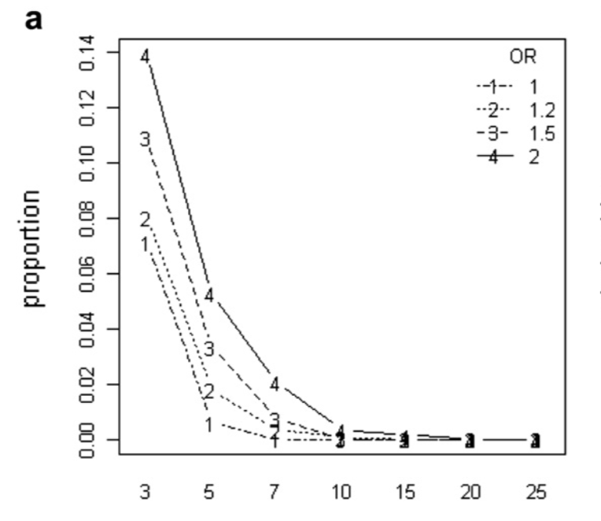
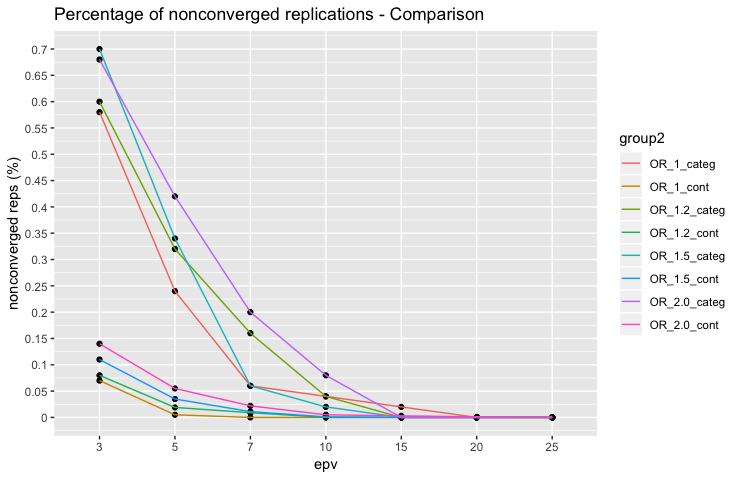

README
================
Raul J.T.A.
11/3/2018

Overview
--------

This investigation concerns the rationale behind the 10-EPV rule of thumb for prognostic modeling, originally proposed in Harrell et al. (1984). Our intuiton was that the rule safeguarded against sparsity in the outcome, indirectly leading to more accurate and reliable estimation of the covariate parameters. To explore the effects of this EPV rule, we replicated the simulation in Courvoisier et al. (2011), except that we considered categorical, instead of continuous covariates. This allowed us to simultaneously explore this notion of sparsity (since the data may be represented by a contingency table, where any of the cells may be sparse) and gauge the validity of Courvoisier et al. (2011) results. Additionally, we begin to explore a new metric which may be more informative than EPV.

In short, I strove to recreate the figure below where the same simulation is created with a categorical predictor.

Technical
---------

All coding including this README file were generated through `R` and `RMarkdown`. In addition, this is a `packrat` project, which means that you may have to install the package `packrat` in an effort to ensure reproducibility. At the least, this package aids reproducibility by checking whether the proper dependencies (R version and packages) are installed on your CPU.

Code structure
--------------

The entire simulation is contained within `epv.R`, and outlined in the first few pages of Courvoisier et al. (2011). In my code, there are certain key functions which are built upon. In short, this is the simulation design:

1.  Create a population satisfying a certain odds ratio.
2.  For some prespecified number of replicates, sequentially sample observations from that population until a pre-specified number of events are reached within each replicate.
3.  Analyze the collection of replicates.

Consequently, I created a list of functions instrumental in recreating ths simulation:

`generate_population(true_or, p0, p1, tolerance=.0001)` - generates a population satisfying some true odds ratio through the clever choice of a *p**o* and *p*1. To choose a *p*0 and *p*1 satisfying the simulation, we used the helper functions `odds_ratio()` and `or_tab`, and did some algebra using a contingecy table.
`generate_replicates(dat, epv, iterations = 500,cores=detectCores()-2)` - backbone function for simulation generating all of the necessary replicates for a choice of EPV and OR. Corresponds to a single point on the graph. Sequentially sampling is the major bottleneck, and so it was parallelized.
`generate_replicates_across_epv(dat,epv,iterations = 500)` - generates a line on the plot; simply calls the former.
`epv_simulation(epv, iterations = 500)` - generates all lines for a plot, i.e. all necessary replicates for a plot.

Results
-------

Running a simulation with a categorical as oppose to a continuous predictor resulted in a much larger proportion of nonconverged parameter estimates. Interestingly, holding EPV constant, it appeared that sequential sampling resulted in identical number of sample sizes across odds ratios, as can be seen in the data frame `n_tab`. In addition, we validated our suspicion that larger odds ratios and smaller EPVs result in more inequitable parameter estimates as measured via the Gini coefficient, and recorded in `gini_tab`. This finding may be extended and explored to propose a metric that would better inform power and sample size estimates for prognostic models, among other things. Below is the our replicated plot with the above plot superimposed on it.

References
----------

Courvoisier, Delphine S, Christophe Combescure, Thomas Agoritsas, Angèle Gayet-Ageron, and Thomas V Perneger. 2011. “Performance of Logistic Regression Modeling: Beyond the Number of Events Per Variable, the Role of Data Structure.” *Journal of Clinical Epidemiology* 64 (9). Elsevier: 993–1000.

Harrell, Frank E, Kerry L Lee, Robert M Califf, David B Pryor, and Robert A Rosati. 1984. “Regression Modelling Strategies for Improved Prognostic Prediction.” *Statistics in Medicine* 3 (2). Wiley Online Library: 143–52.
